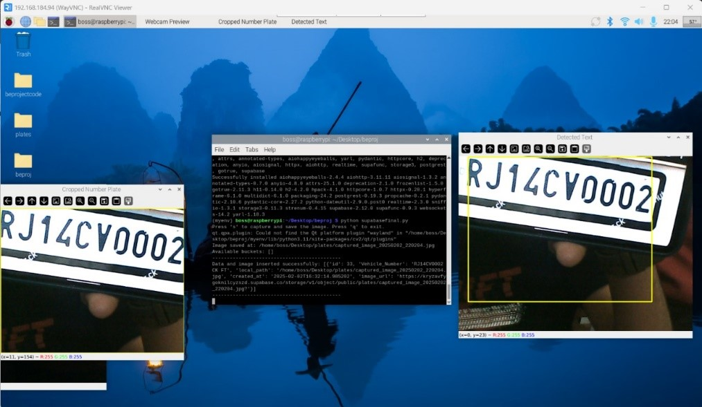
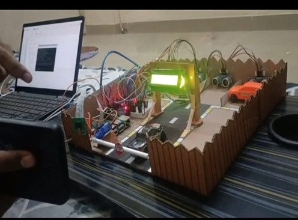
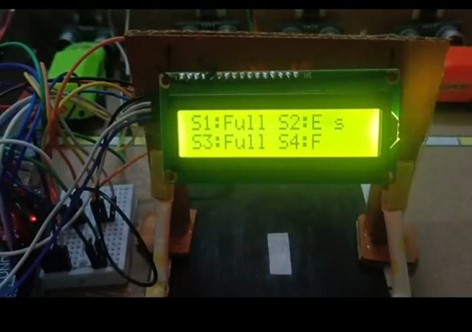
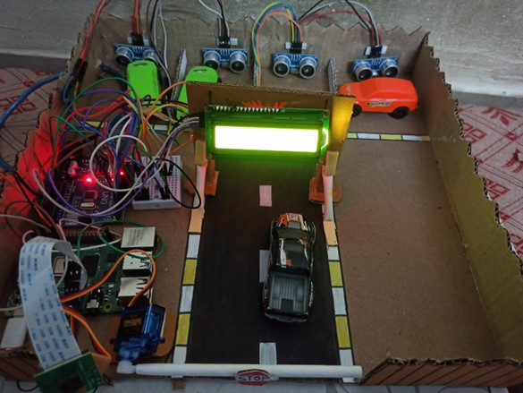

# 🚗 Automatic Vehicle Entry Control System Using Image Processing

A final-year engineering project developed as part of the B.E. Electronics & Telecommunication curriculum under Savitribai Phule Pune University. This system uses image processing, OCR, Raspberry Pi, and Arduino to automate vehicle access based on license plate recognition.

## 📌 Overview

This project automates vehicle access control at gates (e.g., parking lots, corporate premises) using real-time number plate recognition. It captures a vehicle image, processes it using OCR, verifies it against a database, and opens the gate if authorized.

## 👨‍💻 Contributors

- Vyankatesh Vibhute  
- Rushikesh Wakde  
- Shravani Yewale  
- Under the guidance of **Prof. P.P. Gaikwad**  
- Department of E&TC, Sinhgad College of Engineering, Pune

---

## 🎯 Objectives

- Automate toll/entry gate operations
- Real-time license plate detection and verification
- Improve vehicle entry speed and reduce human errors
- Display dynamic parking slot availability
- Ensure secure access using database-driven authentication

---

## 🧰 Hardware Used

- 🧠 Raspberry Pi 4 (central controller)
- 📷 Raspberry Pi Camera Module
- 🔁 Servo Motor (for gate movement)
- 🔌 Arduino UNO (LCD and ultrasonic interface)
- 📟 16x2 LCD Display (for slot status)
- 📡 HC-SR04 Ultrasonic Sensors (to detect vehicle presence)

---

## 🧑‍💻 Software Stack

- Language: Python
- Libraries: OpenCV, EasyOCR, Tesseract OCR
- Arduino IDE (for ultrasonic and LCD logic)
- MySQL or SQLite (for storing authorized vehicle data)
- VNC Viewer / SSH (for headless Pi access)

---

## ⚙️ System Workflow

1. **Vehicle Detected** → Ultrasonic sensor triggers camera
2. **Image Captured** → Camera captures number plate
3. **OCR Recognition** → Using EasyOCR/Tesseract to extract plate text
4. **Authorization Check** → Compares plate number with local DB
5. **Action**:
   - **Authorized** → Gate opens via Servo + LCD displays slot info
   - **Unauthorized** → Gate stays closed + Access Denied displayed
6. **Parking Status** → Ultrasonic sensors detect occupancy and display slot info

---

## 📊 Results

| Metric       | Value         |
|--------------|---------------|
| Accuracy     | 95.6%         |
| Precision    | 94.0%         |
| OCR Method   | EasyOCR/Tesseract |
| Processing Time | < 1s        |
| Real-time Parking Display | ✅ |

---

## 📈 Comparative Advantage

| Feature                     | Proposed System | Traditional Systems |
|----------------------------|-----------------|---------------------|
| Image-Based Entry Control  | ✅              | ❌ (RFID/Sensor only) |
| No Physical Tag Needed     | ✅              | ❌                  |
| Live Slot Availability     | ✅              | ❌                  |
| Works in Real-Time         | ✅              | ⚠️ Limited         |

---

## 🧪 Simulation and Hardware

- Simulated on Proteus (Arduino + Ultrasonic + Servo)
- Final prototype: Working physical gate with real license plate image recognition
- LCD outputs real-time messages like:
  - `Scanning...`
  - `Access Granted`
  - `Slot: Full / Free`

---

## 📷 Screenshots

Number Plate Detection

Servo-based Gate Opening

Real-time LCD Output

System Prototype Top View

---

## 🧠 Future Enhancements

- Integrate night vision IR camera for low light recognition
- Use YOLO or deep learning models for better detection
- Host database on cloud for central multi-gate monitoring
- Add web/mobile dashboard for real-time alerts

---

## 📚 References

- OpenCV Documentation  
- EasyOCR GitHub  
- Tesseract OCR Engine  
- Raspberry Pi GPIO Guide  
- IEEE Research on Vehicle Recognition Systems

---

## 📄 License

This project is for academic use. For commercial or deployment use, please contact the authors.

---

> Made with ❤️ by Group 37 E&TC (2025) – Sinhgad College of Engineering
